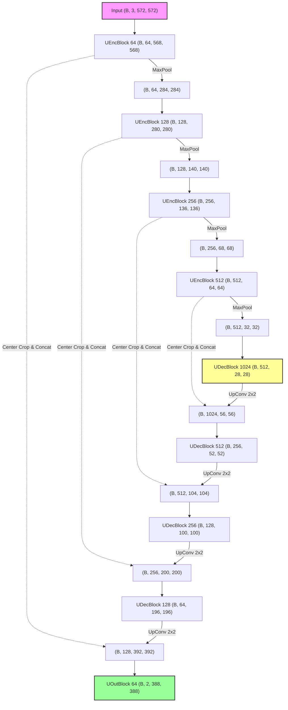

# 🔬 U-Net: Biomedical Image Segmentation

**Paper**: *U-Net: Convolutional Networks for Biomedical Image Segmentation* (Ronneberger et al., MICCAI 2015)  
**Implementation**: PyTorch (From Scratch)  
**Status**: **✅ 모델 아키텍처 구현 완료**

---

## 💡 U-Net 핵심 요약

U-Net은 **인코더-디코더 구조(U-Net Architecture)**와 **지름길 연결(Skip Connection)**을 결합하여, 매우 적은 수의 학습 이미지 데이터셋으로도 정밀한 화소 수준의 이미지 분할(Pixel-wise Segmentation)을 수행할 수 있도록 설계된 컴퓨터 비전 모델입니다.

1. **수축 경로 (Contracting Path - Encoder)**: 컨볼루션과 맥스 풀링을 반복하여 이미지의 전역적 문맥(Context)을 추출합니다.
2. **확장 경로 (Expanding Path - Decoder)**: 전치 컨볼루션(Transposed Convolution)을 통해 점진적으로 공간 해상도를 복원하며, 위치 정보(Localization)를 정교화합니다.
3. **지름길 연결 (Skip Connection)**: 인코더의 특징 맵(Feature Map)을 디코더의 업샘플링된 특징 맵에 직접 연결(Concatenate)하여, 인코딩 과정에서 소실된 고해상도 경계 및 세부 공간 정보를 결합합니다.

---

## 🎨 아키텍처 개요 (Architecture Map)

본 저장소의 구현은 **논문 원본과 동일하게 패딩이 없는(Unpadded) 3×3 Convolution**을 기본으로 사용합니다. 이로 인해 컨볼루션 연산을 거칠 때마다 공간 해상도가 소폭 감소하며, Skip Connection 시 결합할 인코더 특징 맵을 디코더 해상도에 맞춰 정교하게 **중앙 크롭(Center Crop)** 처리합니다. 또한, 실용성을 높이기 위해 첫 레이어 입력을 **3채널(RGB)**로 수정하였습니다.



---

## 🛠️ 모듈화 구현 상세 (`unet_arch.py`)

U-Net의 구조는 유연한 실험과 높은 가독성을 위해 다음과 같이 명확히 모듈화되어 구현되었습니다.

### 1. `UEncBlock` (수축 블록)
- **역할**: 입력 텐서에 3×3 Conv + ReLU 연산을 연속 2회 수행하고, Feature를 저장한 뒤 2×2 Max Pooling(Stride 2)을 수행하여 특징을 절반 크기로 다운샘플링합니다.
- **주요 코드**:
  ```python
  class UEncBlock(nn.Module):
      def __init__(self, in_channels, out_channels):
          super().__init__()
          self.conv1 = nn.Conv2d(in_channels, out_channels, kernel_size=3)
          self.conv2 = nn.Conv2d(out_channels, out_channels, kernel_size=3)
          self.relu = nn.ReLU()
          self.maxpool = nn.MaxPool2d(kernel_size=2, stride=2)
          self.feat = None # Skip Connection을 위해 Conv 통과 직후 특징맵 저장

      def forward(self, x):
          x = self.relu(self.conv1(x))
          x = self.relu(self.conv2(x))
          self.feat = x.clone().detach() # 메모리 참조 차단 후 특징 저장
          x = self.maxpool(x)
          return x
  ```

### 2. `UDecBlock` (확장 블록)
- **역할**: 특징 맵 채널과 크기를 제어하는 Double Conv + ReLU 연산 이후, 2×2 Transposed Convolution(`up_conv`)을 거쳐 공간 차원 해상도를 2배 키우고 채널 수를 절반으로 다운사이징합니다.

### 3. `UOutBlock` (출력 블록)
- **역할**: 복원된 채널 특징 맵에 Double Conv를 거치게 한 후, 최종 분류할 클래스 개수(본 구현에서는 전경/배경 2가지 분류를 위해 `out_channels=2`)에 대응하도록 1×1 Convolution 연산을 거치게 합니다.

### 4. `UNet` (전체 구조 조립 및 Crop-Concat 연산)
- **핵심 연산 (`concat_crop`)**: 인코더 단계의 특징맵 해상도가 디코더 단계보다 크기 때문에, `torchvision.transforms.functional.center_crop`을 사용하여 디코더 해상도에 맞춰 크롭(Crop)한 뒤 채널 차원(`dim=1`)으로 붙여줍니다.
  ```python
  def concat_crop(self, enc_feat, dec_feat):
      crop_enc_feat = center_crop(enc_feat, [dec_feat.size(2), dec_feat.size(3)])
      cat_feat = torch.cat([crop_enc_feat, dec_feat], dim=1)
      return cat_feat
  ```

---

## 🚀 사용법 및 동작 테스트 (Usage & Quick Test)

네트워크 아키텍처가 정상적으로 텐서 차원 전파를 수행하는지 확인하기 위해 파일 내에 단위 테스트가 구성되어 있습니다.

### 테스트 실행 명령어
프로젝트 가상환경이 활성화된 상태에서 실행합니다.

```bash
cd U-Net
python unet_arch.py
```

### 테스트 출력 결과
정상 작동 시, 입력 텐서 `(3, 3, 572, 572)`가 네트워크를 통과한 후 최종 예측 맵 `(3, 2, 388, 388)` 형태로 정확하게 차원 압축 및 복원되었음을 확인할 수 있습니다.

```text
Output shape: torch.Size([3, 2, 388, 388])
```
*(배치 사이즈 3, 채널 수 2, 최종 세그멘테이션 해상도 388×388)*

---

## 📌 주요 특징 및 보완 가능성

- **패딩 미사용(Valid Convolution)**: 이미지 가장자리(Border) 영역의 컨텍스트 손실을 방지하기 위해 경계 미러링(Mirroring Reflection) 기법을 사용하는 논문의 철학에 부합하도록 설계되었습니다.
- **채널 수 수정**: 기존 1채널 흑백 이미지 입력에서 현대 비전 태스크에 호환되도록 **3채널 RGB 입력**으로 수정되었습니다.
- **확장 제안**:
  - 패딩을 추가하여 입력 해상도와 출력 해상도를 일치시키도록 수정 (`padding=1` 활용)
  - 가중치 초기화로 정교화된 Segment Loss 계산(Dice Loss, BCE Loss 혼합) 적용
