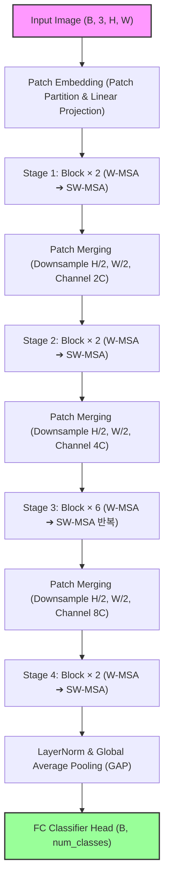

# 🌀 Swin Transformer & Vision Transformer (ViT)

Vision Transformer 계열의 최신 비전 신경망을 연구하고 구현하는 디렉토리입니다.  
**Swin Transformer**의 Shifted Window 연산을 처음부터(From Scratch) 직접 구현하였으며, 전이 학습(Transfer Learning)을 통해 **Tiny-ImageNet에서 초고속 수렴과 최고 정확도(83.16%)**를 기록한 실험 보고서 및 시각화 도구를 포함합니다.  
또한, 표준 **Vision Transformer (ViT)**를 단계별로 빌드할 수 있는 상세 가이드 스켈레톤을 제공합니다.

---

## 📂 디렉토리 구조 및 핵심 파일

```directory
swin_transformer/
├── swin_transformer.py  # Swin-Tiny(Swin-T) 아키텍처 처음부터 끝까지 직접 구현 (W-MSA, SW-MSA 완비)
├── vit.py               # Vision Transformer(ViT) 조립용 단계별 TODO 가이드 스켈레톤 코드
├── train.py             # Swin-T Fine-tuning 스크립트 (ImageNet 사전학습 가중치 로드, AdamW, Cosine Annealing)
├── test.py              # 모델 평가, 학습 곡선 시각화, 클래스 오차 분석, GradCAM 특징 시각화 툴킷
└── result/              # 30 Epoch 학습 로그(train.log), 시각화 결과물 및 수렴 분석 보고서
```

---

## 🌀 1. Swin Transformer 직접 구현 상세 (`swin_transformer.py`)

기존 Vision Transformer(ViT)의 연산량이 이미지 해상도의 제곱에 비례하는 한계 $O(N^2)$를 극복하기 위해, 본 아키텍처는 **선형 연산 복잡도 $O(N)$**를 달성하는 핵심 메커니즘을 PyTorch로 구현하였습니다.



### 💡 구현된 핵심 3대 기술 모듈
1. **Window Attention (W-MSA & SW-MSA)**:
   - 전체 패치가 아닌 $7 \times 7$ 크기의 국소 윈도우 내부에서만 Attention 연산을 수행하여 고해상도 처리 효율을 극대화합니다.
   - **Relative Position Bias (상대 위치 편향)**: 어텐션 스코어 맵에 Relative Bias Table을 생성하고 상대 인덱스 버퍼를 활용해 공간적 위치 관계를 반영합니다.
     $$\text{Attention}(Q, K, V) = \text{softmax}\left(\frac{QK^T}{\sqrt{d}} + B\right)V$$
2. **Shifted Window (이동 윈도우 & 마스킹)**:
   - 인접 윈도우 간 정보 교환을 유도하기 위해 윈도우 크기를 절반(`window_size // 2`)만큼 평행 이동시킵니다.
   - 이동 시 끝 경계면에서 인접하지 않은 픽셀들 간의 비정상적인 어텐션을 차단하도록 **구역별 ID 마스크(Attention Mask)**를 동적으로 연산하여 방지합니다.
   - 효율적인 이동을 위해 `torch.roll()` 연산을 활용하고 계산 완료 후 복원하였습니다.
3. **Patch Merging (패치 병합)**:
   - CNN의 풀링 레이어와 같이 공간 차원을 절반으로 줄이고 채널을 2배로 확장하는 계층 구조를 구현합니다. ($2 \times 2$ 이웃 패치를 채널 방향으로 Concatenate한 후 Linear layer를 통과시킵니다.)

---

## 🖼️ 2. Vision Transformer (ViT) 스켈레톤 가이드 (`vit.py`)

초보자나 학습자가 순수 Transformer 아키텍처의 텐서 흐름을 단계별로 파악하며 완성할 수 있도록 상세 가이드라인과 TODO 마커를 설계해 두었습니다.

### 📝 Step-by-Step 구현 로드맵
* **Step 1**: 이미지를 $16 \times 16$ 크기의 패치 시퀀스로 쪼개고 `nn.Conv2d`를 통해 선형 투영(Projection)하는 `PatchEmbedding` 구현.
* **Step 2**: 전체 문맥을 대표할 `Class Token` 및 1D 위치 정보를 나타내는 학습 가능한 `Positional Embedding` 파라미터 정의.
* **Step 3**: Multi-head Attention과 MLP 피드포워드 이전에 레이어 정규화를 거치는 Pre-LN 기반 `TransformerEncoderBlock` 구현.
* **Step 4 & 5**: 인코더를 깊게 쌓고 최종 `Class Token` 위치의 출력값만을 추출하여 다중 클래스로 매핑하는 분류기 조립.

---

## 📊 3. Tiny-ImageNet 학습 결과 및 성능 분석

ImageNet 사전 학습된 Swin-Tiny 가중치를 활용하여 30 Epoch 동안 전이 학습(Fine-tuning)을 진행한 최종 성과입니다.

### 📈 학습 지표 요약

| 성능 지표 (Metrics) | 초기 (Epoch 1) | 최종 (Epoch 30) | 최고 성능 (Best) |
| :--- | :---: | :---: | :---: |
| **Train Loss** | 2.2945 | 0.9386 | **0.9386** (Epoch 30) |
| **Train Accuracy** | 61.77% | 98.84% | **98.84%** (Epoch 30) |
| **Validation Loss** | 1.5958 | 1.4556 | **1.4542** (Epoch 28) |
| **Val Top-1 Accuracy** | 77.79% | 82.96% | **83.16%** (Epoch 28) |
| **Val Top-5 Accuracy** | 93.58% | 95.25% | **95.26%** (Epoch 28) |

### 🚀 VGGNet(이전 세대) 대비 압도적 격차 분석

```mermaid
gantt
    title Tiny-ImageNet 최고 정확도(Top-1 Acc) 비교
    dateFormat  X
    axisFormat %s
    
    section VGGNet (VGG-D Multi-crop)
    48.67% (80 Epoch 수렴) : 0, 49
    
    section Swin Transformer (Swin-T)
    83.16% (단 28 Epoch 수렴) : 0, 83
```



1. **압도적인 일반화 능력 (+34.49%p)**:
   - 이전 VGGNet 최고 기록인 **48.67%** 대비 Swin Transformer는 **83.16%**를 기록하여 파괴적인 성능 격차를 입증하였습니다.
2. **초고속 수렴 양상**:
   - VGGNet은 80 Epoch 학습 후에야 48.67%에 도달했으나, Swin Transformer는 전이 학습의 수혜와 우수한 어텐션 표현 메커니즘 덕분에 **단 1 Epoch 만에 77.79%**를 터치했습니다.
3. **과적합(Overfitting) 제어**:
   - Train Accuracy가 98.84%에 도달해 일반적인 모델의 경우 큰 폭의 오차 역전 현상이 올 수 있었으나, Swin Transformer는 Val Loss가 1.45 수준에서 철저히 정체/방어되어 훌륭한 견고성을 입증했습니다.

---

## 🛠️ 실행 및 시각화 도구 활용법 (Commands)

### 1. 전이 학습 실행
Swin-Tiny 아키텍처 백본 모델에 Tiny-ImageNet 분류 헤드를 연결하여 학습시킵니다.
```bash
python train.py
```

### 2. 종합 평가 및 시각화 스크립트 실행
`test.py` 스크립트는 단순 평가에 그치지 않고, 풍부한 분석 시각화 이미지 3종 세트를 자동으로 생성합니다.
```bash
python test.py
```

* **출력 로그 예시**:
  ```text
  Test | Top-1 Acc: 83.16% | Top-5 Acc: 95.26% |
  
  === 가장 잘 맞추는 클래스 Top 5 ===
  Class 45 (금붕어): 100.00%
  Class 112 (농구공): 98.00%
  ...
  ```

* **자동 생성되는 시각화 에셋**:
  - `learning_curves.png`: Epoch별 Train/Val Loss 및 Accuracy 학습 추이 곡선 차트.
  - `predictions_sample.png`: 테스트 셋 내 무작위 이미지에 대한 정답 유무(녹색/적색 색상 표시) 및 예측 레이블 시각화 그리드.
  - `gradcam_result.png`: 마지막 Stage의 LayerNorm 레이어 기준 **GradCAM(Gradient-weighted Class Activation Mapping)**을 통과시켜 모델이 물체의 특징적인 어떤 지점을 집중 감시하고 판정했는지 하트맵 형태로 보여주는 강력한 추론 설명 시각화.

---

## 💡 한 단계 더 도약하기 위한 후속 연구 제안
현재 Train Acc 98.84%와 Val Acc 83.16% 간의 격차(Generalization Gap)를 좁히기 위해 다음과 같은 조치를 연계해 볼 수 있습니다:
- **Regularization**: Swin 블록에 `DropPath`(Stochastic Depth) 확률을 높이거나 `Weight Decay` 강도를 소폭 증폭합니다.
- **Data Augmentation**: PyTorch 내장 기능을 활용해 **Mixup** 이나 **CutMix**를 도입하여 픽셀의 단순 조합뿐만 아니라 라벨 혼합 학습을 진행합니다.
